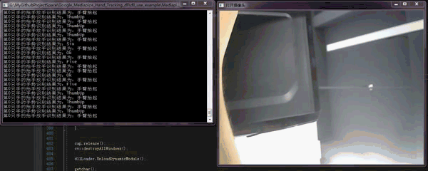

# GoogleMediapipePackageDll

本示例是基于Mediapipe v0.8.6，具体版本如下图所示：

目前有人反映使用Mediapipe的最新版本，可以编译成功代码但是运行不成功的。

目前还没有时间试Mediapipe最新版本是否可行，不过如果使用最新版本进行编译，应使用最新版本的模型而不是我仓库中的模型。

## HandTracking Example

## HolisticTracking Example

# 1 项目简介

将Google Mediapipe中的HandTracking与HolisticTracking功能封装成动态链接库，其中dll/hand_tracking_test对应HandTracking功能的封装，dll/holistic_tracking_dll对应HolisticTracking功能的封装。

# 2 项目组织

- dll文件夹包含了用于生成动态链接库的头文件、源文件、以及Bazel编译项目文件；
- dll_use_example包含一个Visual Studio 2019项目工程，主要是演示如何使用上述编译的动态链接库；

# 3 详细的配置教程

## 3.1 Mediapipe C++在Windows上的编译教程

- [ https://www.stubbornhuang.com/1555/]( https://www.stubbornhuang.com/1555/ " https://www.stubbornhuang.com/1555/")

- [https://stubbornhuang.blog.csdn.net/article/details/119546019](https://stubbornhuang.blog.csdn.net/article/details/119546019 "https://stubbornhuang.blog.csdn.net/article/details/119546019")

## 3.2 封装Mediapipe HandTracking为dll的教程

- [ https://www.stubbornhuang.com/1562/]( https://www.stubbornhuang.com/1562/ " https://www.stubbornhuang.com/1562/")
- [ https://stubbornhuang.blog.csdn.net/article/details/119675282]( https://stubbornhuang.blog.csdn.net/article/details/119675282 " https://stubbornhuang.blog.csdn.net/article/details/119675282")

##  3.3 封装Mediapipe HolisticTracking为dll的教程

-  [https://www.stubbornhuang.com/1919/](https://www.stubbornhuang.com/1919/)
- [https://blog.csdn.net/HW140701/article/details/122606320](https://blog.csdn.net/HW140701/article/details/122606320)

